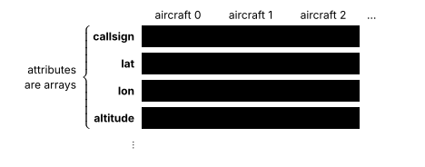
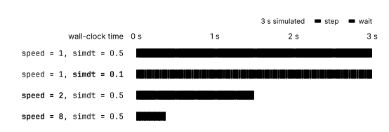

# Minisky 101: Basics

Minisky is a fixed-step, discrete-time simulator. At each timestep $i$, it takes the current state $x_i$ and computes the next state $x_{i+1}$ with some timestep $\Delta t$:
$$
x_{i+1} = f(x_i, \Delta t).
$$
This page focuses on how the state $x_i$ is represented internally and how the timestep $\Delta t$ controls simulation time.

## State

minisky stores most core aircraft state in what we call "traffic arrays", inside [`minisky.Traffic`][].

Unlike typical game engines that model a list of objects, minisky uses the struct-of-arrays (SoA) architecture, where an aircraft is represented as the `i`th entry of each attribute array:

<span class="theme-illustration">
  
  
</span>

Take a simple example of creating an aircraft:

```py
from minisky import MiniSky


with MiniSky() as runtime:
    runtime.traffic.cre(...)
```

Here, the attributes of the aircraft (`runtime.traffic.{callsign, lat, lon...}`) are stored as separate numpy arrays. An aircraft is identified by its *row index* in these arrays. Whenever minisky creates, reads, updates or deletes aircraft, these arrays are kept aligned at all times.

This SoA architecture is also used in many minisky subsystems, including autopilot, performance modelling and conflict detection.

## Stepping

minisky defaults to `simdt = 1s` and `speed = 1`. [`simdt`][minisky.Simulation.simdt] controls how much *simulation time* $\Delta t$ each step advances, with smaller values giving finer temporal resolution. [`speed`][minisky.Runner.speed] on the other hand, controls how quickly those steps are played back, with larger values reducing the *wall-clock* wait time between steps:

<span class="theme-illustration">
  
  
</span>

Internally, when you execute [`MiniSky.run()`][minisky.MiniSky.run], the [runner][minisky.Runner] repeatedly calls [`Simulation.step()`][minisky.Simulation.step], which updates the state and advances the *simulation time* by [`simdt` $\Delta t$][minisky.Simulation.simdt]. Conceptually:

```python hl_lines="1 4"
runtime.simulation.simdt = 0.5  # (1)!

for _ in range(4):
    runtime.simulation.step()  # (2)!
    wait()

print(runtime.simulation.simt)
# 2.0
```

1. Each step represents half a simulation second.
2. Four steps advance two simulation seconds.

Here, the duration of `wait()` depends on the *playback speed* defined by the runner.

```python hl_lines="1"
runtime.runner.speed = 10
await runtime.run()
```
