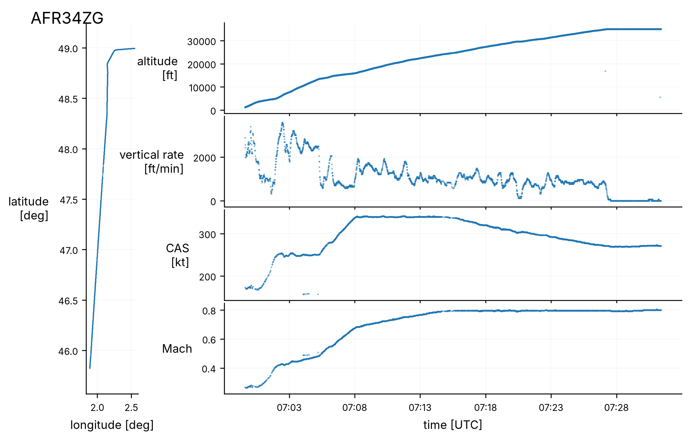
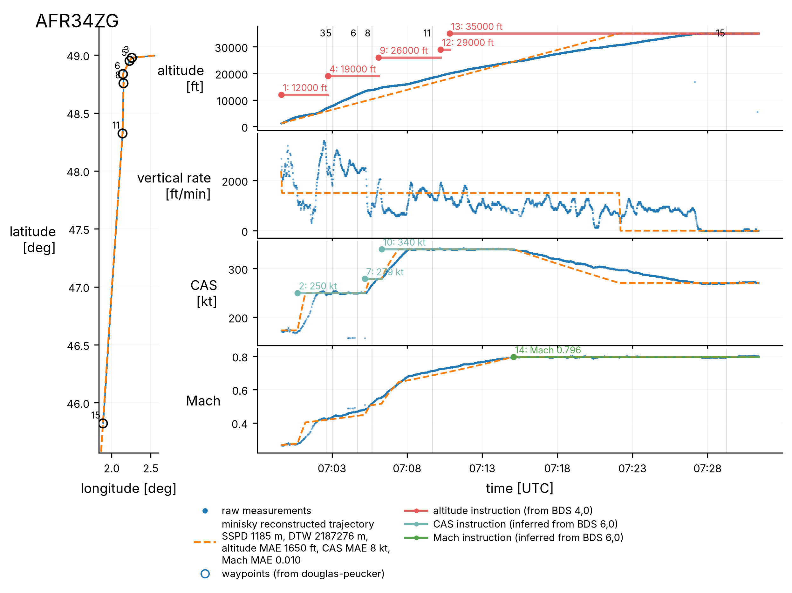

# Trajectory reconstruction

Recent trajectory generation methods like Krauth et al. (2023)[^krauth2023] and Motte et al. (2025)[^motte2025] can generate trajectories that match the statistical distribution of the observed traffic, but do not guarantee that the generated trajectories are physically flyable. In this example, we demonstrate how to evaluate the physical "flyability" of a trajectory following the approach described in Olive et al. (2021)[^olive2021].

<figure class="theme-illustration" markdown="1">
  
  
  <figcaption markdown="1">
Given a reference trajectory $y(t)$ (which is often a noisy observation of the true aircraft state $x(t)$), this example infers a plausible sequence of controller/pilot commands $\hat{u}$. Replaying $\hat{u}$ through minisky gives $\hat{x}(t) = x_0 + \int_0^t f(\hat{x}(\tau), \hat{u}(\tau)) d\tau$ and the simulated trajectory $\hat{y}(t)$. The reconstruction error $e(y, \hat{y})$ can then be used as a measure of flyability[^reconstruction_error_note].
  </figcaption>
</figure>

## Introduction

In this example, we will use the recorded flight `full_flight_short` in the [`traffic` library](https://github.com/xoolive/traffic) as the reference trajectory $y^\star$:

=== "Figure"

    

=== "Code"

    <!-- fmt:off -->
    ```python
    --8<-- "docs/examples/trajectory_reconstruction/main.py:load-data"
    ```
    <!-- fmt:on -->

The goal is to extract controller/pilot commands $u$ from the trajectory above, including its lateral, vertical and speed intent.

## Inferring controller and pilot actions

### Lateral

In LNAV, the aircraft follows the lateral route programmed in the Flight Management System (FMS). The route is represented as a sequence of waypoints, and the autopilot steers the aircraft from one leg to the next. 

Since the FMS route is not available in the surveillance data, we use the Douglas-Peucker algorithm to simplify the trajectory to a small set of points, and use them as waypoints.

<!-- fmt:off -->
```python
--8<-- "docs/examples/trajectory_reconstruction/main.py:lateral0"
# the implementation for `douglas_peucker_indices` is omitted for brevity,
# see the full script below.

--8<-- "docs/examples/trajectory_reconstruction/main.py:lateral1"
```
<!-- fmt:on -->

In practice, there are also other lateral guidance modes, including vectoring and localiser tracking, but we do not implement it here.

### Vertical profile

When the pilot selects a new altitude on the Mode Control Panel (MCP), the aircraft eventually reaches the selected altitude. The *pitch mode* also controls how the aircraft reaches the setpoint. For example, in the B777's `FLCH SPD` mode, the aircraft applies climb thrust and adjusts its pitch to maintain the selected airspeed, causing the vertical rate to often fluctuate during climb. The pilot may also sometimes pick the `V/S` mode to maintain a fixed vertical rate. In practice, there are also other more complicated vertical guidance strategies, such as VNAV and glideslope tracking.

Minisky, however, does not model these dedicated altitude guidance modes. It only has the [`ALT` command][command.ALT], accepting a target altitude and an optional vertical speed. So, we identify stable segments of the MCP selected altitude (Mode S BDS 4,0) and convert them into altitude instructions:

<!-- fmt:off -->
```python
--8<-- "docs/examples/trajectory_reconstruction/main.py:vertical0"
# the implementation for `settled_steps` is omitted for brevity,
# see the full script below.

--8<-- "docs/examples/trajectory_reconstruction/main.py:vertical1"
```
<!-- fmt:on -->

Note that while the `ALT` and [`VS`][command.VS] commands support changing the vertical speed, we do not do so because the surveillance data alone does not reveal which *pitch mode* was active.

### Speed profile

The speed of an aircraft typically follows a constant Calibrated Airspeed (CAS) or a constant Mach profile. During climb, the aircraft typically flies at constant CAS until some *crossover altitude*, where it switches to a Mach target. Above the crossover, CAS starts to decrease while Mach remains constant.

Our goal is to infer these commands from surveillance data:
<!-- fmt:off -->
```py
--8<-- "docs/examples/trajectory_reconstruction/main.py:speed0"
```
<!-- fmt:on -->

To do that, we look for stable CAS regions, and infer a Mach target from the end of the climb. We also identify the crossover altitude using minisky's atmosphere model:

<!-- fmt:off -->
```python
# the implementation for `tail_median`, `merge_plateaus`, `stable_plateaus`
# are omitted for brevity. see the full script below.
--8<-- "docs/examples/trajectory_reconstruction/main.py:speed1"
```
<!-- fmt:on -->

Note that this crossover logic currently only handles climb segments. Descent speed profiles will require a more general algorithm.

## Replay

With the three types of extracted commands defined, we can compile them into a "plan":

<!-- fmt:off -->
```python
--8<-- "docs/examples/trajectory_reconstruction/main.py:plan"
```
<!-- fmt:on -->

and replay them sequentially through minisky to yield the reconstructed trajectory:

=== "Figure"

    

=== "Code"

    <!-- fmt:off -->
    ```python
    --8<-- "docs/examples/trajectory_reconstruction/main.py:replay"
    ```
    <!-- fmt:on -->

Overall, the reconstructed trajectory $\hat{y}$ (in orange) matches the original reference trajectory $y$ (in blue) quite closely. The `traj_dist_rs` library was also used to compute the Symmetric Segment-Path Distance (SSPD) and Dynamic Time Warping (DTW) distance, which can be used as indicators for "flyability"[^reconstruction_error_note].

??? note "Full script"

    <!-- fmt:off -->
    ```toml title="pyproject.toml"
    --8<-- "docs/examples/trajectory_reconstruction/pyproject.toml:5:11"
    ```

    ```py
    --8<-- "docs/examples/trajectory_reconstruction/main.py"
    ```
    <!-- fmt:on -->

[^krauth2023]: T. Krauth, B. Figuet, X. Olive, and J. Morio, "Collision Risk Assessment in Terminal Manoeuvring Areas based on Trajectory Generation Methods," *Proceedings of the 15th USA/Europe Air Traffic Management Research and Development Seminar*, Savannah, GA, June 2023.

[^motte2025]: A. Motte, X. Olive, and J. Morio, "Conditional Variational Autoencoders for aircraft type-specific trajectory generation," 2025.

[^olive2021]: X. Olive, J. Sun, M. C. R. Murça, and T. Krauth, "A Framework to Evaluate Aircraft Trajectory Generation Methods," *Proceedings of the 14th USA/Europe Air Traffic Management Research and Development Seminar*, 2021.

[^reconstruction_error_note]: The reconstruction error should be interpreted with care because it also depends on the capabilities of the simulator. A real, physically flyable trajectory may still reconstruct poorly in minisky due to limitations in minisky's simulator dynamics. For example, minisky's simplified altitude guidance cannot reproduce the changing vertical rate that may result from an `FLCH SPD` climb.

